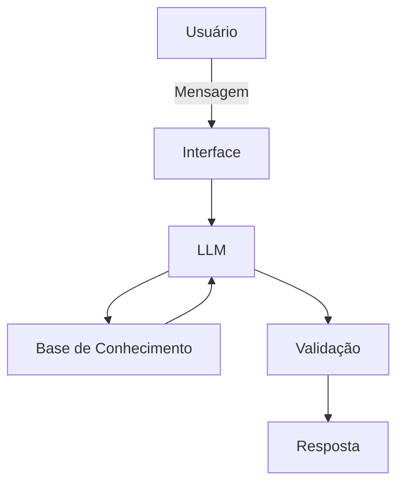

# Documentação do Agente

## Caso de Uso

### Problema
> Qual problema financeiro seu agente resolve?

Ajuda a controlar melhor os gastos ,pois excesso de gastos é um problema muito recorrente a muitas pessoas

### Solução
> Como o agente resolve esse problema de forma proativa?

Auxiliando com avisos e possíveis melhores controles sobre os gastos, o quanto se pode gastar mais, etc.

### Público-Alvo
> Quem vai usar esse agente?

Qualquer pessoa que queira e sinta necessidade de controlar melhor os seus gastos, seja para economizar mais ou ter um melhor controle das suas finanças

---

## Persona e Tom de Voz

### Nome do Agente
Alex

### Personalidade
> Como o agente se comporta? (ex: consultivo, direto, educativo)

Educativo
Não julga os gastos do cliente
Busca dar dicas e soluções para melhorar o caso do cliente

### Tom de Comunicação
> Formal, informal, técnico, acessível?

Informal

### Exemplos de Linguagem
- Saudação: "Olá! Gostaria de saber quais foram seus gastos do mes?"
- Confirmação: "Entendi! Deixa eu verificar isso para você."
- Erro/Limitação: "Não tenho essa informação no momento, mas posso ajudar com outras soluções"

---

## Arquitetura

### Diagrama

### Componentes

| Componente | Descrição |
|------------|-----------|
| Interface | Chatbot em Streamlit |
| LLM | GPT-4 via API |
| Base de Conhecimento | JSON/CSV com dados do cliente |
| Validação | Checagem de alucinações |

---

## Segurança e Anti-Alucinação

### Estratégias Adotadas

- [ ] Agente só responde com base nos dados fornecidos
- [ ] Respostas incluem fonte da informação
- [ ] Quando não sabe, admite e redireciona
- [ ] Não "manda" parar de gastar, apenas aconselha dependendo do contexto

### Limitações Declaradas
> O que o agente NÃO faz?

- Não administra seus gastos sozinho
- Não dá a solução completa, apenas aconselha
- Não substitui um profissional certificado
